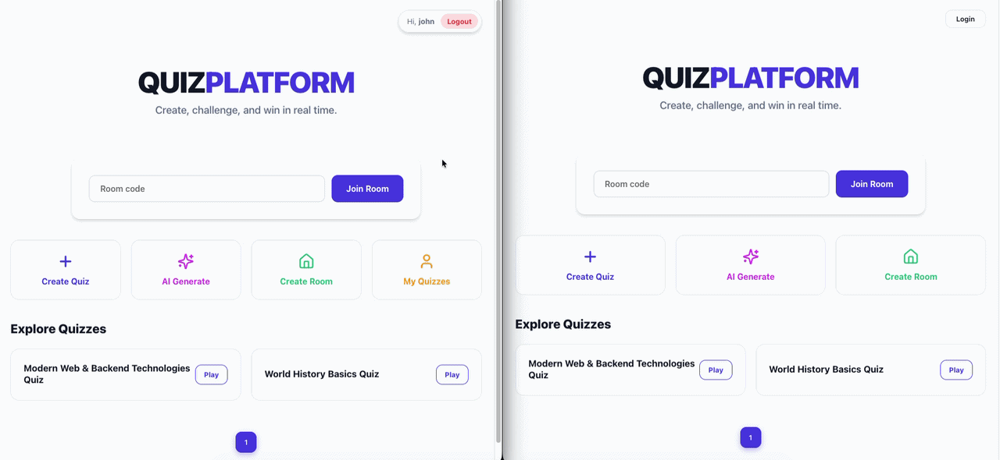

# Real-Time Quiz Platform


A real-time multiplayer quiz platform where users can create, join, and compete in interactive challenges. Built with a distributed microservices architecture to handle persistent quiz data and low-latency game states.

## Key features
- **Multiplayer Rooms**: Join live sessions via WebSockets for a synchronized gaming experience.

- **Solo Mode**: Practice quizzes individually at your own pace.

- **Quiz Creator**: Registered users can design and save custom quizzes.

- **Hybrid Auth**: Seamless access for both registered users and anonymous guests.

## Architecture Diagram
<p align="center">
    
</p>

The system is designed as a distributed set of services:

**API Gateway**: It serves as the single entry point, handling dynamic routing, load balancing across service replicas, and managing WebSocket protocol upgrades for the entire ecosystem.

**Quiz Service**: A Python (FastAPI) service that manages the lifecycle of quizzes (CRUD), persisting data in MongoDB.

**Game Service**: The core engine for multiplayer logic. It handles WebSocket connections for real-time interaction and uses Redis Pub/Sub to synchronize state across multiple instances.

**AI Service**: A Python (FastAPI) service integrated with Ollama that leverages LLMs to automatically generate structured quizzes based on user prompts.

**Identity Provider**: Keycloak (backed by PostgreSQL) manages user identity, ensuring secure access to the creator dashboard.

## Tech Stack

**Frontend:** React with TypeScript

**Backend:** Python & FastAPI for high-performance asynchronous endpoints.

**Inter-service Communication:** gRPC for efficient, low-latency communication between the Game and Quiz services.

**Real-time:** WebSockets for bi-directional client-server communication.

**MongoDB**: Scalable NoSQL for quiz storage.

**Redis**: In-memory store for game session state and real-time messaging.

**PostgreSQL**: Relational storage for Keycloak identity data.

**Observability**: OpenTelemetry tracing with Tempo, centralized logs with Loki (ingested by Alloy), and visualization in Grafana.

## Technical Decisions
**API Gateway & Load Balancing**: The system utilizes Traefik as a single entry point, managing dynamic Service Discovery via Docker labels. It acts as both a reverse proxy and a Load Balancer, distributing traffic across service replicas and natively handling WebSocket protocol upgrades.

**gRPC vs REST**: Using gRPC for internal service communication (Game Service → Quiz Service) allows to reduce overhead and benefit from strict Protobuf contract definition.

**Redis for State Management**: Since game rooms are highly volatile, Redis provides the sub-millisecond latency required to track game status.

**WebSocket Connection Resilience**: To prevent resource leaks caused by silent client disconnections, the Game Service leverages native Uvicorn protocol-level heartbeats.

**Horizontal Scalability**: The architecture is designed to scale horizontally. By combining Traefik’s load balancing with Redis Pub/Sub, the platform can handle increased loads by simply spinning up more service replicas without losing state consistency.

**CI**: Automated pipeline via GitHub Actions that runs Linter and Unit Tests on every push, ensuring code quality and coverage for the backend.

**Observability**: Traces and logs are centralized in Grafana. Backend services emit OpenTelemetry traces and structured JSON logs with `trace_id` / `span_id` correlation.

**Shared Observability Library**: Logging and tracing is decoupled into a dedicated, reusable GitHub repository (fastapi-observability-lib).

## Running the Application

### Prerequisites
- Docker
- Docker Compose
- Ollama (Required only if you want to use the AI quiz generation feature)

### Setup

1. Copy the example environment file to create your local `.env` file:
   ```bash
   cp .env.example .env
   ```

2. Configure Ollama (Optional for AI Generation).
   Ensure Ollama is running locally on your machine and has the required model pulled (e.g., `llama3.1:8b` or your configured model):
   ```bash
   ollama run llama3.1:8b
   ```

3. Launch the full application:
   ```bash
   docker compose up -d
   ```
Once running, the web interface will be available at: **http://localhost**

### Observability Endpoints

The application includes an observability stack based on **OpenTelemetry**, **Grafana Tempo**, and **Grafana Loki** for distributed tracing and centralized logging.

- **Grafana**: **http://localhost:3000**

   From Grafana you can inspect service traces, search structured logs, and correlate requests across microservices using `trace_id` and `span_id`.

## Using the Application

Start by creating a new quiz room or joining an existing one using a room code. Once inside, participants are automatically connected through a WebSocket session that keeps the game state synchronized in real time.

When the host starts the quiz, questions are broadcast simultaneously to all connected players. Each participant can select an answer, and the system immediately processes and updates responses across all clients without requiring page refreshes.

This demo showcases real-time multiplayer synchronization, where both question delivery are handled instantly.

<p align="center">

</p>